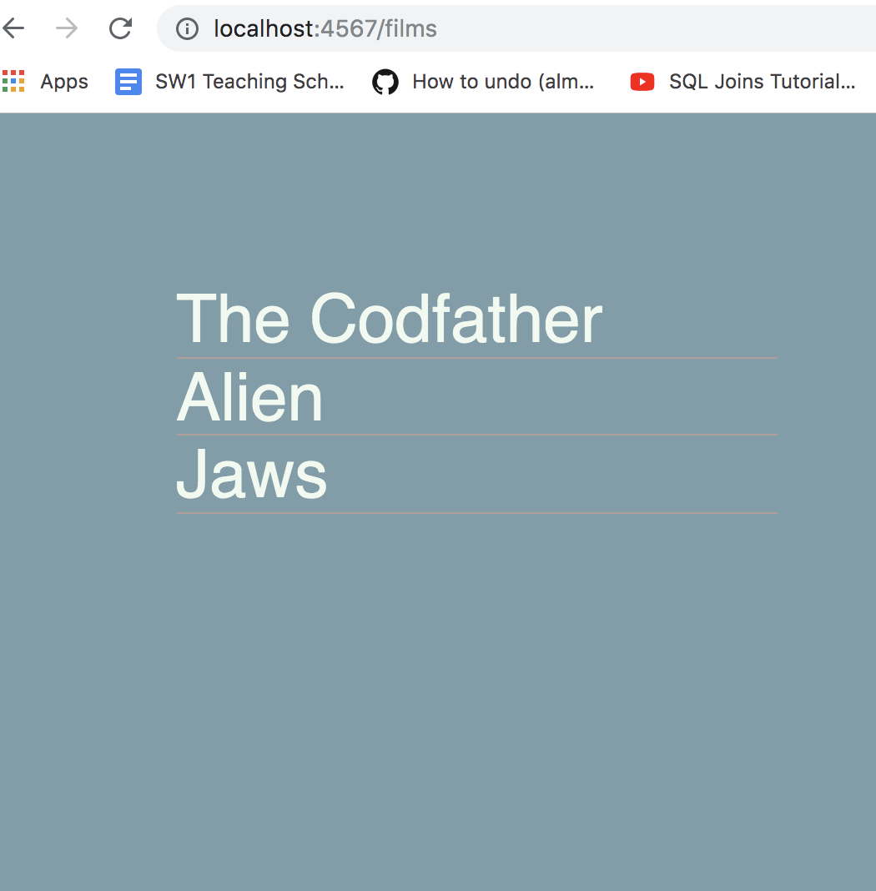
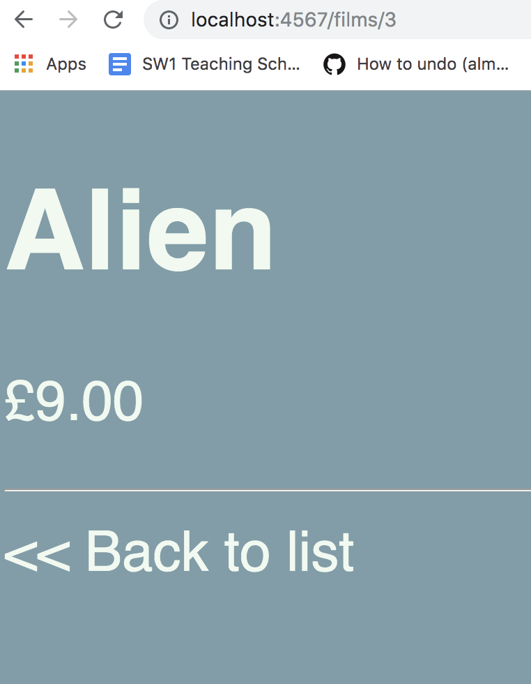

# Sinatra Films Homework

## MVP

Use the solution to your weekend homework (or use our solution). Add a controller and views to render a list of all the films in an unordered list.

## User Needs

"As a cinema goer I want to visit **localhost:4567/films** and see a list of films"

1. Create a **controller.rb**
2. Create a **views** directory
3. Create a new file called **index.erb** inside the directory
4. In the **controller.rb**, use the `Film.all()` method to get all the film objects and pass them to the view.

##Helpful Hints

1. Remember to check the database name, you may need to create/recreate it, run the sql file to make the tables and run the **console.rb** to add some sample data.
2. Remember the difference between <% %> and <%= %>
3. You may need to use a for loop in the view file to display all the films...

```erb
  <% for singular in array %>
    <%= singular.name %>
  <% end %>
```

Your list should look something like this:



## Further

Make the film titles **anchor tags** that link to a view of the individual film details.

Your film details page should look something like this:



You're going to add a stylesheet to the app. In order to do this you'll have to create a **layout.erb** in your views directory.

Use Sinatra's layout.erb and <%= yield %> to create a side-wide template and apply a stylesheet to your app.

Your stylesheet should be in a directory called **public** at the same level as views and models

```
<link rel="stylesheet" href="/style.css">
```

Can you use CSS to remove the bullet points from the list of films and centre them in the screen?

NOTE: You'll have to create a find_by_id method in the Film class.

BONUS: Use a colour palette to find good colours that work together (https://coolors.co)
